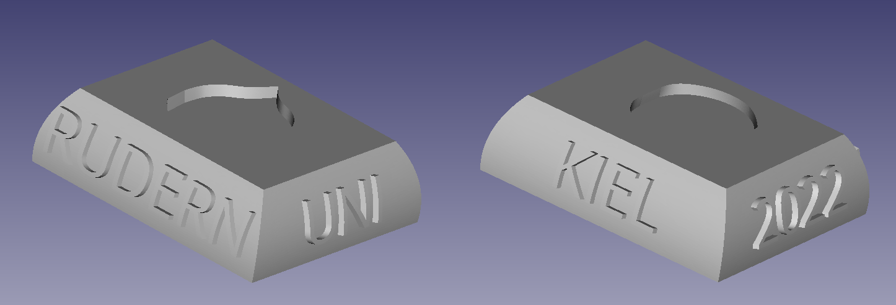

# Rowing trophy

Rowing trophy customized for Kiel University Rowing.

## Editing text

To edit texts on the base in `rowing-base-uni-kiel.FCStd` using [FreeCAD](https://www.freecadweb.org/),
just edit any `ShapeString` and recompute the model. The export `Fusion` to `.stl`.

## Print

- Files: `blade.stl` and `rowing-base-uni-kiel-Fusion.stl`
- Size: 20%
- Material: PLA

## Attributions

The trophy is based on the work of Mauro Saghessi: <https://www.thingiverse.com/thing:2750984>
